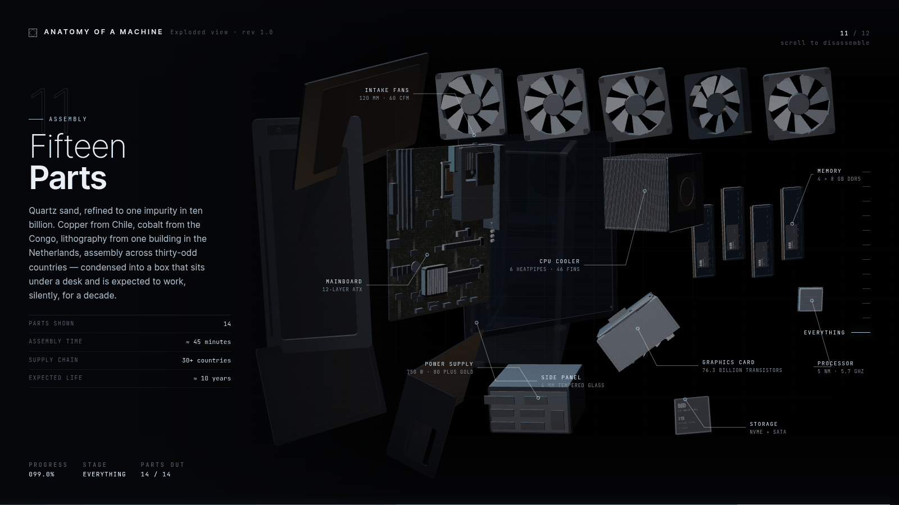
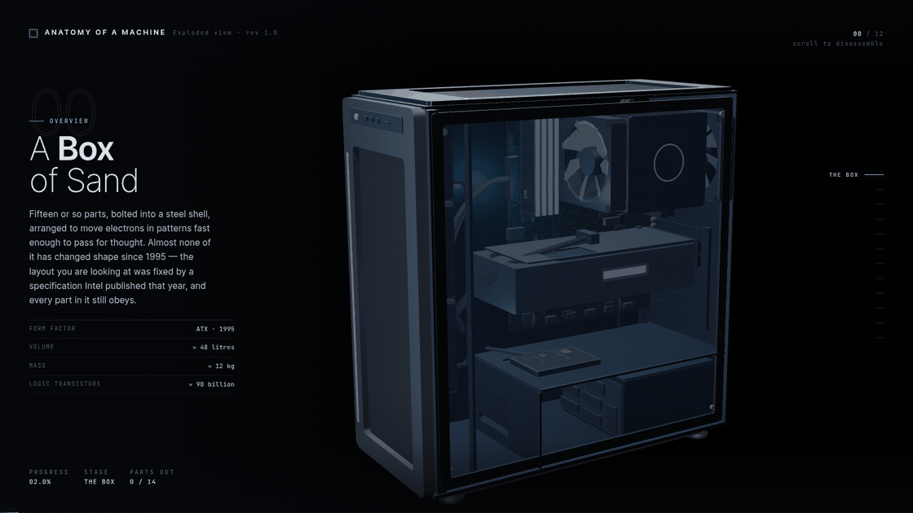
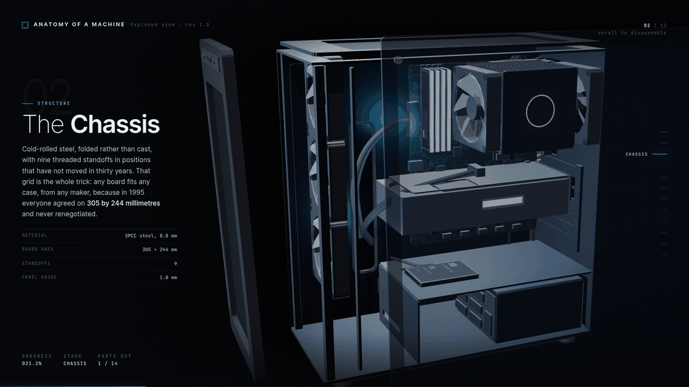
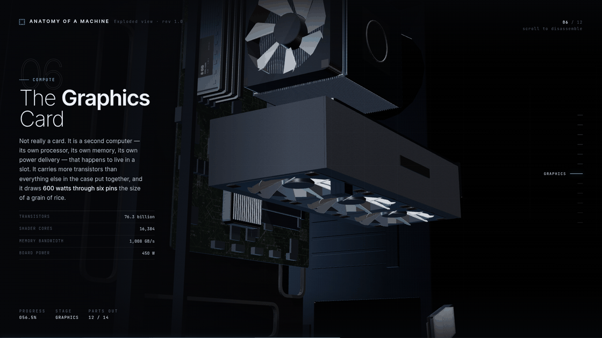
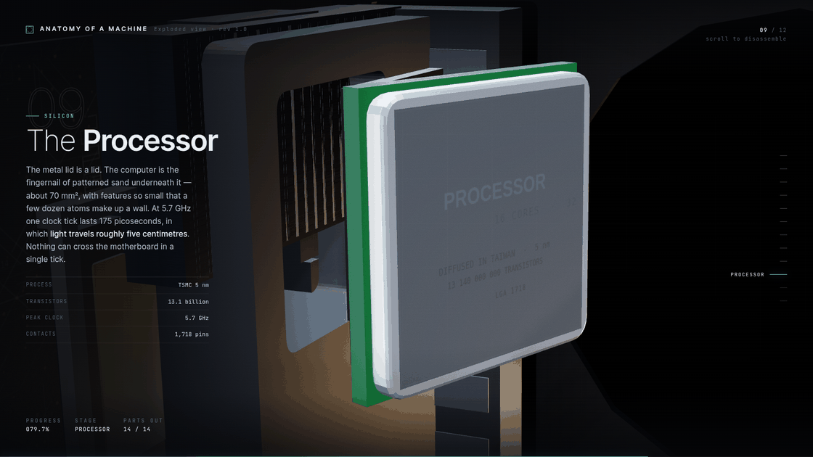

<div align="center">

# Anatomy of a Machine

**A scroll-driven exploded view of a desktop computer.**

One HTML file. No network, no CDN, no models, no images.




</div>

---

Scroll, and the machine takes itself apart. The tower turns, the glass panel
slides off, the fans spin out, the supply drops away, and the card, the cooler
and the processor follow it, until every part is hanging in space with a leader
line and a name. Twelve chapters, each with a fact worth knowing.

Halfway down, when the power supply comes out, **the machine dies**: the RGB
fades, the interior goes dark, and the fans spin down under their own inertia.
Everything after that is a cold teardown.

## Get it

Download `Anatomy-of-a-Machine.html` from the [latest release][rel] and open it.
That is the entire installation procedure. It works from `file://`, offline,
forever.

[rel]: ../../releases/latest

```
git clone git@github.com:AnthonyMorton-iwnl/anatomy-of-a-machine.git
xdg-open anatomy-of-a-machine/dist/Anatomy-of-a-Machine.html
```

## Chapters

| | | |
|--:|---|---|
| 00 | A Box of Sand | the intact machine |
| 01 | Tempered Glass | side panel |
| 02 | The Chassis | steel shell, and why any board fits any case |
| 03 | Moving Air | four 120 mm fans, positive pressure |
| 04 | The Supply | **power dies here** |
| 05 | Trapped Charge | SSD and M.2 |
| 06 | The Graphics Card | 76.3 billion transistors |
| 07 | Leaking Memory | DRAM, and the 64 ms refresh |
| 08 | The Heatpipe Tower | water boiling at 30 °C |
| 09 | The Processor | macro on the lid |
| 10 | Twelve Layers | why the traces wiggle |
| 11 | Fifteen Parts | the exploded plate |

<table>
<tr>
<td width="50%"></td>
<td width="50%"></td>
</tr>
<tr>
<td width="50%"></td>
<td width="50%"></td>
</tr>
</table>

## How it's built

Nothing here is modelled by hand or downloaded.

**Geometry** is composed from three.js primitives, mostly `ExtrudeGeometry` with
rounded-rect shapes and punched holes, plus `InstancedMesh` for the repeated
parts (46 cooler fins, 90 GPU fins, capacitors, standoffs). The dimensions come
from the ATX specification rather than from eyeballing it: a 305 × 244 mm board,
20.32 mm expansion-slot pitch, a 158.75 mm rear I/O aperture, 120 mm fans. That
is why the RAM sits awkwardly close to the cooler, exactly as it does in a real
build.

**Textures** are drawn on a 2D canvas at load: the PCB copper traces and their
serpentine length-matching squiggles, the hex mesh, the fan grilles, the brushed
metal roughness, the product labels. There is not a single image file.

**Lighting** is a procedural studio environment, built as emissive planes and run
through `PMREMGenerator`, with ACES filmic tone mapping. No HDRI.

**Choreography.** Each part has two destinations: where it drifts during its own
chapter, and where it settles in the final plate. Once a chapter passes, the part
keeps receding and dims to a ghost so it never wanders into the next shot, and the
finale brings all fourteen back. The camera tracks parts by name rather than
running on a fixed rail, sitting at `focus + direction × distance`, with distance
matched to the size of whatever it is looking at.

**Not used:** GSAP, ScrollTrigger, Lenis, Locomotive, Theatre.js, R3F, drei,
Tailwind, any postprocessing package. Scrolling is the native document scroll with
a damping constant; the glow is emissive material and additive sprites rather than
an `UnrealBloomPass`, which would have dragged in the whole addons tree.

## Working on it

```
src/index.html          shell, CSS, HUD markup
src/app.js              scene, choreography, camera, HUD driver   (1,244 lines)
vendor/three.core.js    three.js r160, export statement rewritten
fonts/                  Inter + JetBrains Mono, latin variable subsets
build.js                inlines all of the above into one file

node build.js           → dist/Anatomy-of-a-Machine.html
```

No `package.json`, no `node_modules`, no bundler. Node is used only to
concatenate three files and wrap the app in an IIFE.

Two traps that cost real time, recorded so they don't cost it twice:

* `String.replace` with a payload containing `$'` splices in the text *after* the
  match. three.js contains a literal `'$'`, which silently moved `</body></html>`
  into the middle of a regex. `build.js` uses replacer **functions** for this reason.
* three.js declares top-level `clamp`, `lerp` and `smoothstep`, so the app is
  wrapped in an IIFE at build time to avoid redeclaration errors.

### URL parameters

```
?t=0.62           jump straight to that point in the scroll
?t=0.62&lock=1    freeze there and ignore scrolling
```

`./shots.sh 0.2 0.6 0.9` renders those frames headlessly through Chrome and
SwiftShader. Every screenshot in this README was made that way.

`./serve.sh` puts the file on `:6969` for viewing from another device, from a
directory containing only that one file. `./serve.sh stop` takes it down.

## Behaviour

* Real document scroll: wheel, trackpad, touch, space, Page Up/Down, Home and End
  all work. Position is damped so the motion stays continuous.
* Honours `prefers-reduced-motion`.
* Responsive. Under 820 px the fact panel moves below the model, and on narrow
  viewports the camera pulls back rather than widening the lens.
* Falls back to a plain message where WebGL is unavailable.

## Third-party

Vendored, never fetched at runtime:

* **three.js r160** — `vendor/three.core.js`, MIT, © three.js authors. Unmodified
  but for the final `export { … }`, rewritten to `const THREE = { … }` so it can be
  inlined as a plain script. The licence header is intact at the top of the file.
* **Inter** and **JetBrains Mono** — `fonts/`, SIL Open Font License 1.1.

Everything in `src/` is original, and is MIT licensed.
